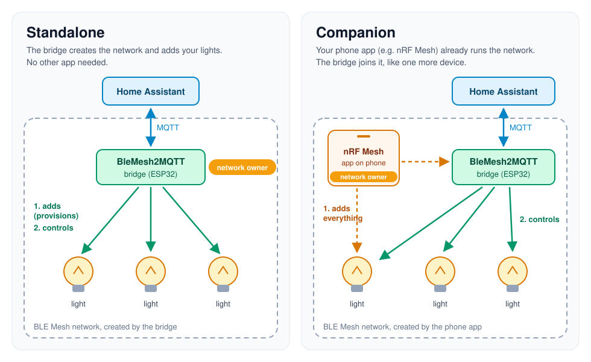

# BleMesh2MQTT Bridge

[](https://opensource.org/licenses/MIT)
[](https://github.com/espressif/esp-idf)
[](https://github.com/ludodefgh/esp32-blemesh2mqtt/releases)
[](https://github.com/ludodefgh/esp32-blemesh2mqtt/issues)

| Supported Targets | ESP32 | ESP32-S3 | ESP32-C3 | ESP32-C6 | ESP32-C5 (preview) |
| ----------------- | ----- | -------- | -------- | -------- | ------------------ |

> **Note**: All supported targets require at least **4MB of flash memory** and **WiFi connectivity**.
> On ESP32-C3/C5/C6, the firmware is updated over USB (single firmware slot, no room for
> WiFi updates — [#44](https://github.com/ludodefgh/esp32-blemesh2mqtt/issues/44)); the web
> interface still updates over WiFi.

An ESP32 bridge between BLE Mesh devices and MQTT, for use with Home Assistant and other home-automation platforms.

📖 **[User Guide — Web Interface & Home Assistant Integration](documentation/USER_GUIDE.md)**

## 🧭 Two editions: Standalone or Companion?

The firmware comes in two editions. The only difference is **who is in charge of your
BLE Mesh network**:

- **Standalone**: the bridge creates the network and adds your lights itself. No other app
  needed. *Not sure? Pick this one.*
- **Companion**: your lights are already set up in a phone app such as nRF Mesh. The bridge
  joins that network like one more device, and the app stays in charge.



👉 **[Which edition do I need?](documentation/EDITIONS.md)** (simple guide, with setup steps for each)

## 🌟 Key Features

- **BLE Mesh ⇄ MQTT bridge**: discovers, provisions and manages BLE Mesh devices
  (Standalone), or joins your existing mesh and controls its lights (Companion), with
  bidirectional message forwarding to MQTT
- **Home Assistant auto-discovery**: devices appear as native lights, switches and
  sensors — no manual YAML
- **Web interface**: dark-first responsive dashboard with live status, per-node
  controls (on/off, brightness, HSL, colour temperature) and system logs
- **OTA**: firmware, web interface, or a single combined `update_bundle.bin`
  (flashes both, restarts once); rollback protection
- **WiFi captive portal** (RFC 8910) for first-time setup, with auto-recovery
- **Encrypted credential storage** for WiFi and MQTT

## 🏗️ Architecture Overview

```
┌─────────────────┐    ┌──────────────────┐    ┌─────────────────┐
│   BLE Mesh      │    │  BleMesh2MQTT    │    │  Home Assistant │
│   Devices       │◄──►│     Bridge       │◄──►│   via MQTT      │
│  (Lights, etc.) │    │    (ESP32)       │    │                 │
└─────────────────┘    └──────────────────┘    └─────────────────┘
                              │
                              ▼
                       ┌─────────────┐
                       │ Web Interface│
                       │ (Management) │
                       └─────────────┘
```

## 🚀 Quick Start

### Option A: Pre-compiled Binaries (No ESP-IDF Required) ⚡

1. **Download Pre-built Firmware**
   - Go to [Releases](https://github.com/ludodefgh/esp32-blemesh2mqtt/releases)
   - Download the `.zip` file for your [edition](documentation/EDITIONS.md) and board
     (e.g., `BleMesh2Mqtt-Standalone-v0.2.0-esp32.zip`)
   - Extract the archive

2. **Flash to Device**
   - **Web Flash** (Easiest - Chrome/Edge): Visit [ESP Web Tools](https://web.esphome.io/)
   - **Command Line**: See `FLASH_INSTRUCTIONS.txt` in the downloaded archive
   - **Windows Tool**: Use [ESP Flash Download Tool](https://www.espressif.com/en/support/download/other-tools)

3. **Initial Setup**
   - Device creates WiFi AP: `BleMesh2MQTT-Setup-XX:XX:XX`
   - Connect and navigate to `192.168.4.1`, enter your WiFi settings
   - Once the bridge is on your network, open its dashboard and set your MQTT broker
   - Then add your lights: from the bridge's dashboard (Standalone), or by adding the bridge
     to your mesh from your phone app (Companion) — see [EDITIONS.md](documentation/EDITIONS.md)

### Option B: Build from Source (Dev Container) 🛠️

The recommended development environment uses a **Dev Container** that includes all tools pre-configured (custom ESP-IDF with BLE Mesh fixes, compilers, VS Code extensions).

### Prerequisites
- [Docker Desktop](https://www.docker.com/products/docker-desktop/)
- [VS Code](https://code.visualstudio.com/) with the [Dev Containers extension](https://marketplace.visualstudio.com/items?itemName=ms-vscode-remote.remote-containers)
- ESP32 development board with **4MB+ flash** and **WiFi** (ESP32, ESP32-S3, ESP32-C3, or ESP32-C6)
- Home Assistant instance with MQTT broker

### 1. Clone Repository
```bash
git clone https://github.com/ludodefgh/esp32-blemesh2mqtt.git
cd esp32-blemesh2mqtt
```

### 2. Open in Dev Container
- Open the folder in VS Code
- When prompted, click **"Reopen in Container"** — or use the Command Palette: `Dev Containers: Reopen in Container`
- Wait for the container to build (first time only, ~5-10 minutes — downloads the custom ESP-IDF image)

> **Note**: The container automatically includes the custom ESP-IDF fork with BLE Mesh fixes. No manual ESP-IDF installation is needed.

### 3. Configure and Build
```bash
# Set your target device (ESP32, ESP32-C3, etc.)
idf.py set-target esp32

# Configure project (optional - defaults work for most cases)
idf.py menuconfig

# Build the project (Standalone edition, the tracked sdkconfig.defaults)
idf.py build

# Or the Companion edition, in its own build directory
idf.py -B build_companion -D SDKCONFIG=build_companion/sdkconfig \
  -D SDKCONFIG_DEFAULTS="sdkconfig.defaults;sdkconfig.defaults.companion" build

# Release packages for both editions and all targets
./build-all-targets.sh
```

### 4. Flash and Monitor
```bash
# Flash to device (connected via USB to the host machine)
idf.py -p /dev/ttyUSB0 flash monitor
```

### 5. Initial Setup
1. **Connect to WiFi**: Device creates `BleMesh2MQTT-Setup` AP on first boot
2. **Access Web Interface**: Navigate to `192.168.4.1` and configure WiFi
3. **Configure MQTT**: on the dashboard's Bridge page, set your Home Assistant MQTT broker
4. **Add your lights**: Standalone: enable device discovery and provision them from the
   dashboard. Companion: add the bridge from your mesh app (see [EDITIONS.md](documentation/EDITIONS.md))

## 📱 Web Interface Guide

Access the web interface at your device's IP address after WiFi setup:

### **Bridge Dashboard** 🌉
- System status and health monitoring
- Memory usage and uptime tracking
- WiFi and MQTT connection status
- Bridge control functions

### **Mesh** 📡
- Standalone: provisioned and unprovisioned devices in one view, one-click provisioning
  and unprovisioning
- Companion: the lights found in your group addresses (External Mesh Nodes), the bridge's
  own mesh address, its group address subscriptions, and "Leave mesh network"
- The network keys
- Per-node controls (on/off, brightness, HSL colour, colour temperature, level) shown
  according to the models each node reports

### **Firmware** 💾
- Firmware, web-interface, or combined-bundle updates
- Live upload progress, validation and rollback

Live system logs are available from a collapsible dock at the bottom of every page.

## ⚙️ Configuration

Everything is configured from the web interface: WiFi (setup access point on first boot),
MQTT broker (host, port, credentials) and, in Companion, group addresses. Standalone generates the mesh
keys and device addresses itself; Companion receives them from the app that adds it to
your network. Credentials are stored encrypted.

## 🏠 Home Assistant Integration

Devices appear automatically via MQTT discovery: lights (on/off, brightness, colour,
colour temperature), covers for level-only devices, plus the bridge's own switches,
restart button and diagnostic sensors.

### MQTT Topics Structure
```
blemesh2mqtt_<MAC>/
├── bridge/
│   ├── state                     # Availability (online/offline)
│   ├── info                      # System information (IP, memory, uptime, RSSI)
│   ├── provisioning/{state,set}  # Standalone only: node discovery switch
│   ├── auto_provisioning/{state,set}  # Standalone only
│   └── restart/set               # Restart button
├── node_<MAC>/                   # A light the bridge provisioned (Standalone)
│   ├── set                       # Commands (HA JSON light schema, or OPEN/CLOSE for covers)
│   ├── state                     # State
│   └── set_position              # Covers only: position 0-100
└── ext_<ADDR>/                   # A light found on a joined mesh (Companion)
    └── set, state, set_position  # Same as node_<MAC>
```
Discovery configs are published under `homeassistant/{light,cover,switch,button,sensor}/`.

## 🔧 Development

### Project Structure
```
├── main/
│   ├── ble_mesh/         # BLE Mesh provisioner / node, External Mesh Nodes
│   ├── mqtt/             # MQTT bridge and Home Assistant integration
│   ├── web_server/       # HTTP server and REST API
│   ├── wifi/             # WiFi management and captive portal
│   ├── ota/              # Over-the-air update system
│   ├── security/         # Credential encryption and security
│   ├── littlefs/         # Web interface static files
│   └── common/           # Shared utilities and definitions
├── test/                 # Hardware test rig firmware + regression scripts
├── .devcontainer/        # Dev Container config (Docker + VS Code)
└── documentation/        # User guides and screenshots
```

### Custom ESP-IDF
Uses a forked ESP-IDF (`ludodefgh/esp-idf`, branch `ble-mesh-fixes`) with BLE Mesh
fixes (mesh-core init, OOB provisioning, error recovery). It ships in the Dev
Container image — no manual install.

## 🐛 Troubleshooting

### Common Issues

**Dev Container / ESP-IDF Issues**
```bash
# If the ESP-IDF environment is not sourced:
source /opt/esp/idf/export.sh

# If the container needs to be rebuilt (Command Palette in VS Code):
# Dev Containers: Rebuild Container

# Verify ESP-IDF is available:
idf.py --version
```

**Build Errors**
```bash
# Clean build and try again:
idf.py fullclean
idf.py build

# If you get partition errors:
idf.py erase-flash
idf.py flash
```

**Device Not Found** — check power, USB cable/port, the port in your flash command,
and that USB-to-serial drivers (CP210x / CH340) are installed.

**WiFi Connection Failed** — 2.4GHz only (not 5GHz); check SSID/password in the
captive portal; try disabling client isolation and 802.11w on the router.

**MQTT Not Connecting** — use the broker's IP (not hostname); check credentials,
firewall, and that the broker accepts the bridge's IP.

**BLE Mesh Provisioning Failed** (Standalone) — put the target device in provisioning mode, move
it within 1–2 m, reduce nearby BLE interference; the device must support BLE Mesh.

**Companion: no External Mesh Nodes found** — check in your mesh app that the AppKey is
bound to the bridge's client models and that your lights' models are subscribed to a
group address, then add that same group on the dashboard's Mesh page and click
**Discover**.

**Captive Portal Not Appearing** — wait ~30–60 s, then open `192.168.4.1` manually;
disable mobile data; some Android devices need "Use network as is".

**Out of Memory** — lower `CONFIG_BLE_MESH_MAX_PROV_NODES` in menuconfig and disable
debug logging for production builds.

### Debug Tools
- `idf.py monitor` — serial logs (`Ctrl+]` to exit)
- Web dashboard — live logs and heap usage
- `mosquitto_sub -h <broker> -t 'blemesh2mqtt_#'` — watch MQTT traffic

## 🤝 Contributing

Fork, branch, follow the existing code style, test on real hardware, and open a PR.
Bugs and questions: GitHub Issues / Discussions.

## 📄 License

MIT — see the LICENSE file.
