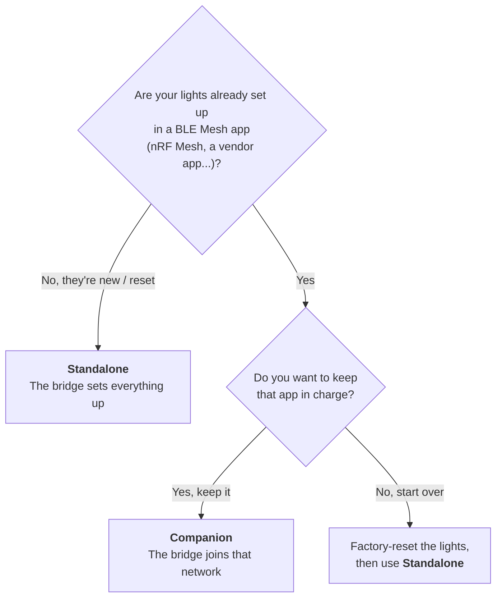
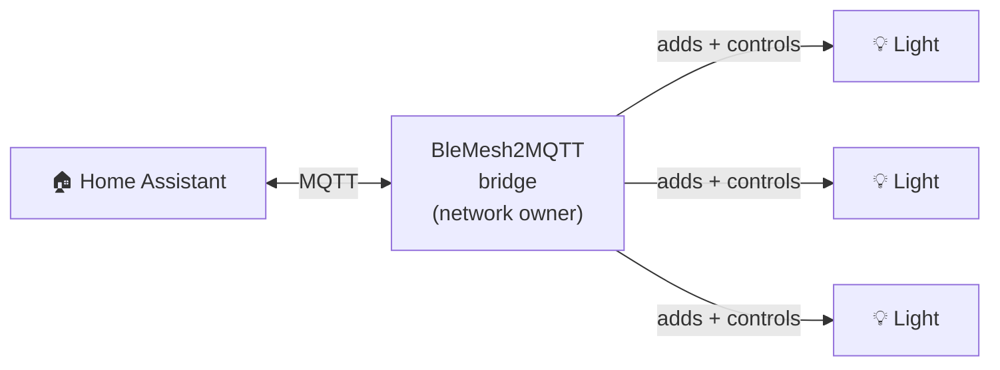
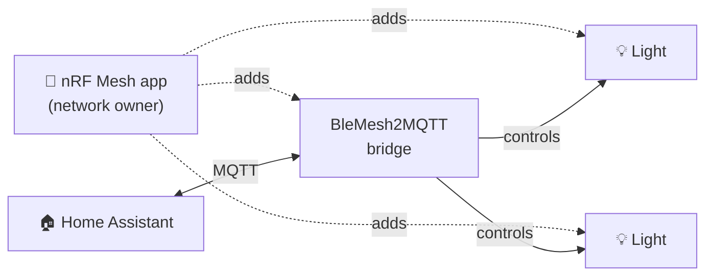

# Standalone or Companion? Choosing your edition

BleMesh2MQTT comes in **two editions**. They share the same dashboard and the same Home
Assistant integration. The only difference is **who is in charge of your BLE Mesh network**.


| | **Standalone** | **Companion** |
|---|---|---|
| **In one sentence** | The bridge creates the network and adds your lights. | The bridge joins a network you already run from a phone app. |
| **Who owns the network** | The bridge | Your phone app (e.g. nRF Mesh) |
| **Who adds new lights** | The bridge (from its dashboard) | Your phone app |
| **Other app needed?** | No | Yes, your existing mesh app |
| **Keep using your phone app?** | No, the lights now belong to the bridge | Yes, it keeps working as before |
| **Good for** | Starting fresh, or lights not set up yet | Lights you already set up and don't want to redo |

## Which one do I need?



**Not sure?** Pick **Standalone**. It's the simplest: one device, no phone app.

## A few words you'll see

- **BLE Mesh network**: the wireless network your lights use to talk to each other.
  It's protected by secret keys, so only devices that were *added* to it can control it.
- **Provisioning** (adding a device): giving a new device the keys of the network. A
  light that isn't provisioned yet shows up as an *unprovisioned device*.
- **Network owner** (the *provisioner*): the only one that can add or remove devices.
  A network has one owner. In Standalone it's the bridge; in Companion it's your phone app.

## How each edition works

### Standalone: the bridge runs everything



1. Flash the **Standalone** firmware, then join the bridge's `BleMesh2MQTT-Setup-…` WiFi
   and enter your WiFi and MQTT settings. The bridge creates a new mesh network by itself.
2. Put your lights in pairing mode (factory reset). They appear under **Mesh → Unprovisioned
   Devices** in the dashboard.
3. Click **Provision** (or turn on **Auto-provisioning**). Each light is added, configured,
   and shows up in Home Assistant.

### Companion: the bridge joins your existing network



1. Flash the **Companion** firmware, then join the bridge's `BleMesh2MQTT-Setup-…` WiFi
   and enter your WiFi and MQTT settings. No keys to type in.
2. In your mesh app (e.g. nRF Mesh), add the bridge like any new device. It shows up as
   an unprovisioned device.
3. In the app, on the bridge's element, **bind your AppKey** to its client models
   (Generic OnOff Client, Generic Level Client, Light Lightness Client, Light HSL Client,
   Light CTL Client).
4. In the bridge's dashboard, on the **Mesh** page, add the **group address** your lights
   are subscribed to (for example `0xC000`). The bridge then finds the lights in that group
   by itself (**External Mesh Nodes**), and they show up in Home Assistant.

Your phone app stays the network owner. Add or remove lights from the app as before;
the bridge picks up new ones on its next scan (every 10 minutes, or click **Discover**).

## What's different in the dashboard

The header shows which edition is running: **BleMesh2MQTT Standalone** or
**BleMesh2MQTT Companion**. Home Assistant shows it too, as the bridge device's model.

| Dashboard feature | Standalone | Companion |
|---|:---:|:---:|
| Unprovisioned devices / Provision button | ✅ | — (your app adds devices) |
| Auto-provisioning switch | ✅ | — |
| Provisioned nodes (with Unprovision) | ✅ | — |
| External Mesh Nodes (found in your group addresses) | — | ✅ |
| Bridge's own mesh address, "Leave mesh network" | — | ✅ |
| Group address subscriptions, Mesh keys | ✅ | ✅ |
| Light controls, Home Assistant integration | ✅ | ✅ |

## Common questions

**Can I switch editions later?**
Yes, but not with a web update: the Firmware page only accepts updates for the edition
that's already installed, so an update can't wipe your mesh setup by accident. To switch,
flash the other edition over USB (see `FLASH_INSTRUCTIONS.txt`), preferably after an
erase. You then set up the mesh side again, the Standalone way or the Companion way.

**I have lights set up in nRF Mesh. Can Standalone take them over?**
Not directly. Only the network owner knows the secrets needed to manage a light. Either
use **Companion**, or factory-reset the lights and add them again with Standalone.

**In Companion, can the bridge remove a light from the network?**
No. Only the network owner (your phone app) can. **Forget** in the dashboard just removes
it from the bridge and from Home Assistant.

**How do I remove the bridge from my network (Companion)?**
Preferably with "Reset node" on the bridge, from your phone app. The dashboard's
**Leave mesh network** button also works, but your app isn't told, so the bridge stays
listed there until you remove it.

**Which file do I download?**
Release files are named `BleMesh2Mqtt-<Edition>-<version>-<chip>.zip`, e.g.
`BleMesh2Mqtt-Companion-v0.2.0-esp32.zip`. Pick the edition, then your chip.

## For developers

Both editions build from the same source. The edition is picked at build time:
`CONFIG_BLE_MESH_PROVISIONER` builds Standalone, `CONFIG_BLE_MESH_NODE` builds Companion.
They can't be combined in one binary. The overlays `sdkconfig.defaults.standalone` and
`sdkconfig.defaults.companion` select one on top of `sdkconfig.defaults`:

```bash
idf.py -B build_companion -D SDKCONFIG=build_companion/sdkconfig \
  -D SDKCONFIG_DEFAULTS="sdkconfig.defaults;sdkconfig.defaults.companion" build
```

`./build-all-targets.sh [targets] [editions]` builds and packages every combination
(both editions by default), and the release workflow does the same in CI. Every image
carries a `BM2MQTT-EDITION:<name>` marker, which the OTA update checks before switching
to the new image.
