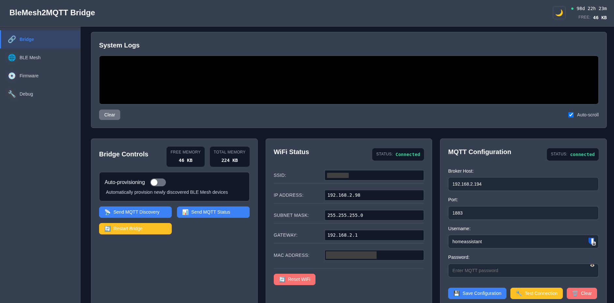
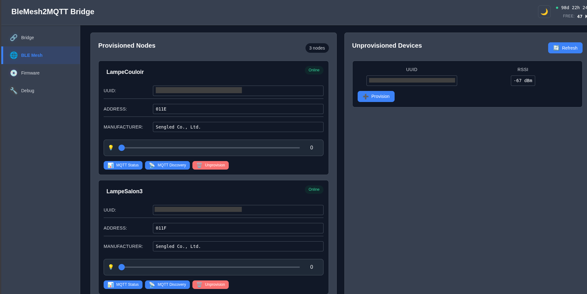
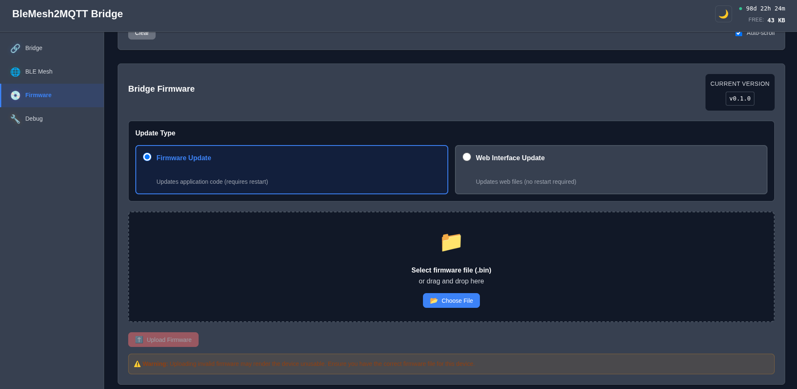
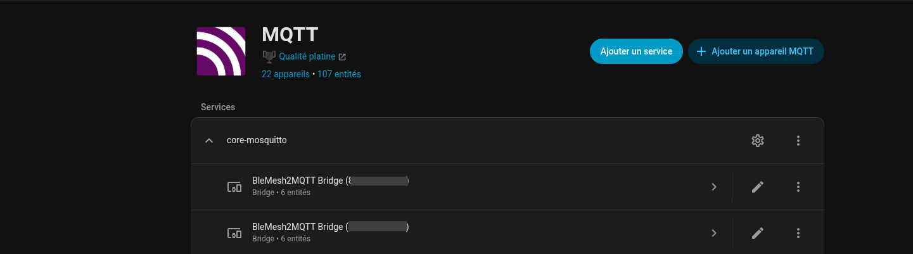
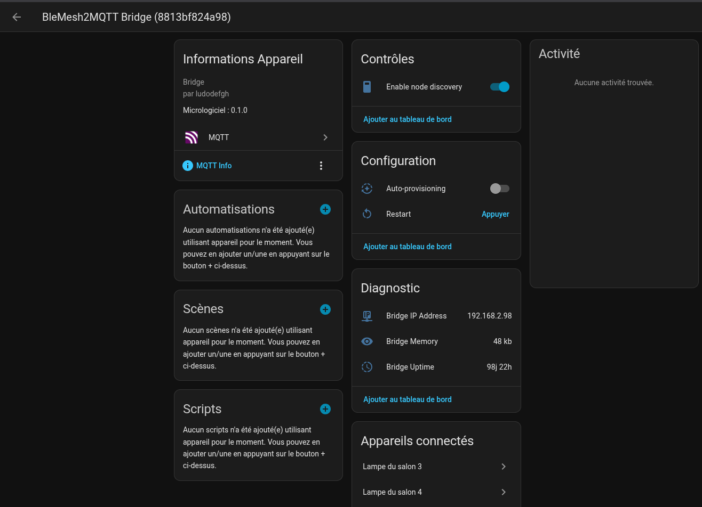

# BLEMesh2MQTT Bridge — User Guide

This guide explains how to use the bridge's web interface and how to find it in Home Assistant.

---

## Table of Contents

1. [Bridge Web Interface](#1-bridge-web-interface)
   - [Bridge Page — Main Dashboard](#11-bridge-page--main-dashboard)
   - [BLE Mesh Page — Device Management](#12-ble-mesh-page--device-management)
   - [Firmware Page — Updates](#13-firmware-page--updates)
2. [Home Assistant Integration](#2-home-assistant-integration)
   - [MQTT Integration View](#21-mqtt-integration-view)
   - [Bridge Device Detail](#22-bridge-device-detail)

---

## 1. Bridge Web Interface

Once the bridge is connected to your WiFi network, access its web interface by entering its IP address in a browser (e.g. `http://192.168.2.98`).

The interface is divided into 4 sections accessible from the left menu: **Bridge**, **BLE Mesh**, **Firmware**.

---

### 1.1 Bridge Page — Main Dashboard

This page is the bridge's control center. It is divided into three panels:

#### System Logs
At the top of the page is a real-time log console. It displays important events (MQTT connections, device discovery, errors, etc.).
- **Clear**: clears the displayed logs.
- **Auto-scroll**: keeps the view scrolled to the latest messages (enabled by default).

#### Bridge Controls
This panel shows the microcontroller's memory status and provides several actions:

| Indicator / Button | Description |
|---|---|
| **FREE MEMORY** | Available memory on the ESP32 (here 46 KB). Monitor this if the bridge becomes unstable. |
| **TOTAL MEMORY** | Total allocated memory (here 224 KB). |
| **Auto-provisioning** | When enabled, the bridge automatically provisions any newly detected BLE Mesh bulb without manual intervention. Disabled by default. |
| **Send MQTT Discovery** | Resends MQTT discovery messages to Home Assistant (useful if HA cannot see the devices). |
| **Send MQTT Status** | Publishes the current state of all devices to MQTT. |
| **Restart Bridge** | Restarts the bridge (equivalent to a reboot). |

#### WiFi Status
Displays the bridge's network connection information:
- **SSID**: name of the WiFi network the bridge is connected to.
- **IP ADDRESS**: the bridge's IP address on your local network.
- **SUBNET MASK / GATEWAY**: standard network parameters.
- **MAC ADDRESS**: unique identifier of the bridge (also used as its identifier in HA).
- **RSSI**: received signal strength from the WiFi access point (in dBm — the closer to 0, the stronger the signal). Useful for diagnosing connectivity issues.
- **TX POWER**: current WiFi transmit power (in dBm). Can be adjusted via the interface to reduce interference or improve range.
- **Reset WiFi**: clears saved WiFi credentials and restarts in captive portal mode to reconfigure the network.

#### MQTT Configuration
Used to configure the connection to the MQTT broker:

| Field | Description |
|---|---|
| **Broker Host** | IP address or hostname of the MQTT broker (e.g. your Home Assistant server running Mosquitto). |
| **Port** | MQTT port, typically `1883`. |
| **Username / Password** | Credentials for connecting to the broker. |
| **Save Configuration** | Saves the settings and reconnects the bridge to the broker. |
| **Test Connection** | Tests the connection to the broker without saving. |
| **Clear** | Clears the form fields. |

> The **STATUS: connected** badge in the top-right corner of this panel indicates the bridge is successfully connected to the MQTT broker.

---

### 1.2 BLE Mesh Page — Device Management

This page is used to manage BLE Mesh bulbs. It is divided into two columns:

#### Provisioned Nodes (left column)
Lists all bulbs already provisioned (joined) into the bridge's BLE Mesh network. The badge in the top-right shows the total number of nodes (here: **3 nodes**).

For each provisioned bulb, you can see:
- **Name** of the bulb (e.g. `LampeCouloir`) — assigned at provisioning time.
- **UUID**: unique BLE identifier of the bulb.
- **ADDRESS**: BLE Mesh address within the network (e.g. `011E`).
- **MANUFACTURER**: bulb manufacturer (e.g. `Sengled Co., Ltd.`).
- **Brightness slider**: directly controls the bulb's brightness from the interface.
- **MQTT Status**: publishes the current state of this bulb to MQTT.
- **MQTT Discovery**: resends the discovery message for this bulb to Home Assistant.
- **Unprovision**: removes the bulb from the BLE Mesh network (it will reappear in "Unprovisioned Devices").

The **Online** badge indicates the bulb is responding to BLE Mesh commands.

#### Unprovisioned Devices (right column)
Lists BLE Mesh bulbs detected within range but not yet joined to the network.

- **UUID**: identifier of the detected bulb.
- **RSSI**: radio signal strength (in dBm — the closer to 0, the stronger the signal).
- **Provision**: click this button to add the bulb to the bridge's BLE Mesh network.
- **Refresh**: triggers a new BLE scan to detect nearby devices.

> **Tip:** if a bulb does not appear in "Unprovisioned Devices", make sure it is powered on and within range of the bridge, then click **Refresh**.

---

### 1.3 Firmware Page — Updates

This page allows you to update the bridge without a USB cable (OTA — Over The Air).

The currently installed version is shown in the top-right corner (**CURRENT VERSION: v0.1.0**).

#### Update Types

| Type | Description |
|---|---|
| **Firmware Update** | Updates the ESP32 application code. The bridge restarts automatically when done. |
| **Web Interface Update** | Updates only the web interface files. No restart required. |

#### Update Procedure

1. Download the appropriate `.bin` file from the project's releases page.
2. Select the correct update type.
3. Drag and drop the `.bin` file into the drop zone, or click **Choose File** to select it.
4. Click **Upload Firmware**.
5. Wait for the process to complete. For a firmware update, the bridge will restart automatically.

> **Warning:** do not cut power to the bridge during a firmware update. This could brick the device.

---

## 2. Home Assistant Integration

The bridge registers itself automatically in Home Assistant via the **MQTT Discovery** protocol. No manual Home Assistant configuration is needed, as long as the MQTT integration is already set up with the same broker.

---

### 2.1 MQTT Integration View

In Home Assistant, go to **Settings → Devices & Services → MQTT**.

One or more **BleMesh2MQTT Bridge** devices will appear, identified by their MAC address (e.g. `0123456789123`). Each physical bridge corresponds to a separate device.

> If the bridge does not appear, go to the bridge's web interface and click **Send MQTT Discovery** (Bridge page).

---

### 2.2 Bridge Device Detail

Clicking on a bridge in the list opens its detail page.

#### Device Information
- **Firmware**: currently installed firmware version.
- **MQTT / MQTT Info**: links to the associated MQTT entities.

#### Controls
- **Enable node discovery**: enables or disables discovery of new BLE Mesh nodes from Home Assistant.

#### Configuration
- **Auto-provisioning**: enables automatic provisioning of newly detected bulbs.
- **Restart**: remotely restarts the bridge from Home Assistant.

#### Diagnostic
Useful information for troubleshooting:

| Entity | Description |
|---|---|
| **Bridge IP Address** | The bridge's IP address on your network. |
| **Bridge Memory** | Free memory available on the ESP32. |
| **Bridge Uptime** | Time elapsed since the bridge last started. |

#### Connected Devices
Lists the BLE Mesh bulbs provisioned on this bridge (e.g. `Lampe du salon 3`, `Lampe du salon 4`). Click on a bulb to access its controls (on/off, brightness, etc.).
