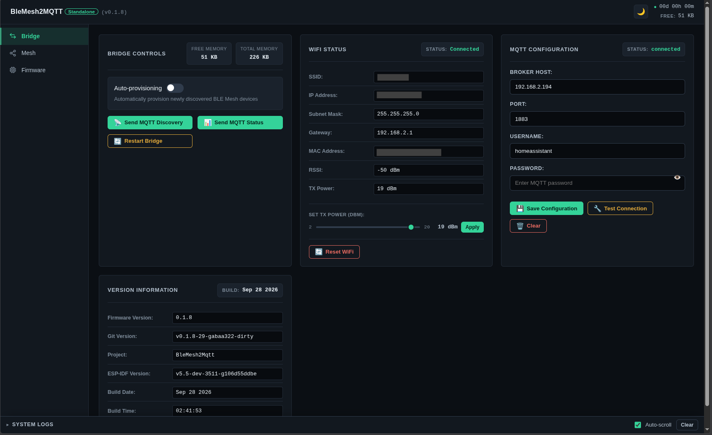
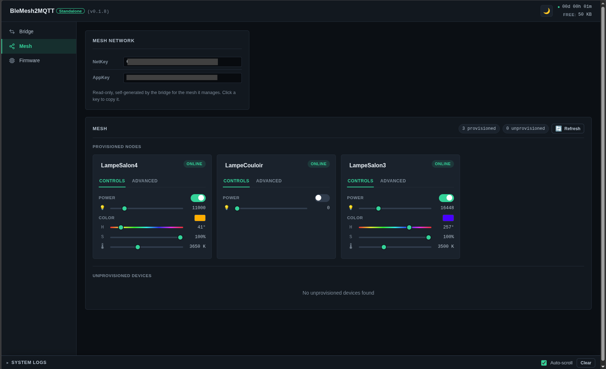
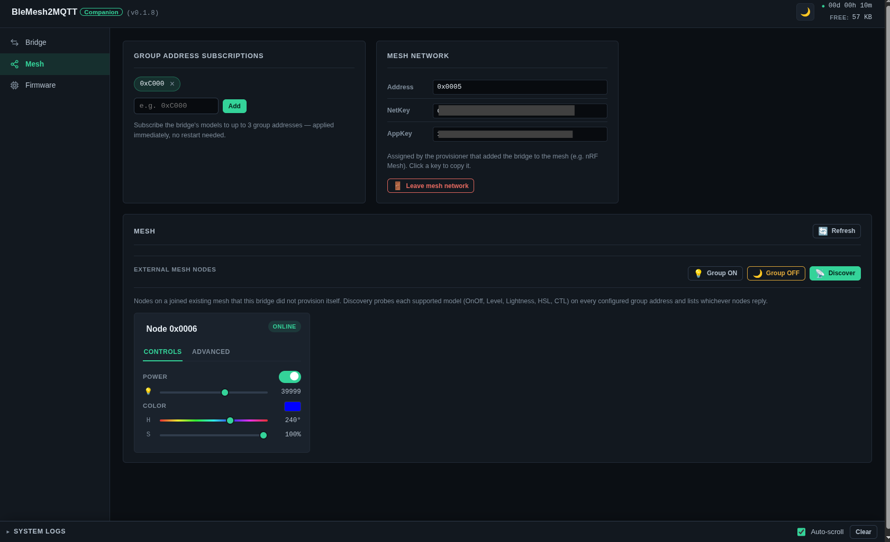
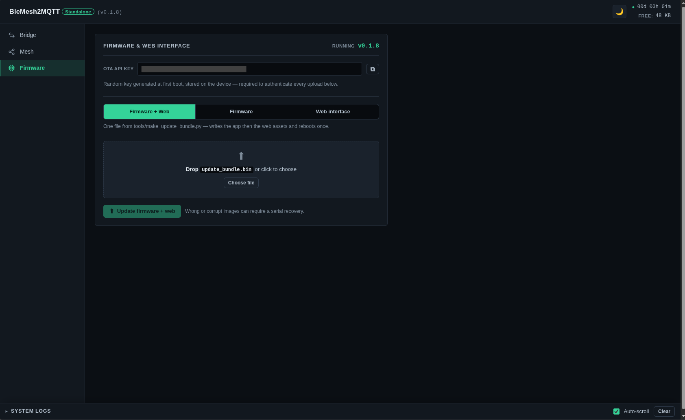
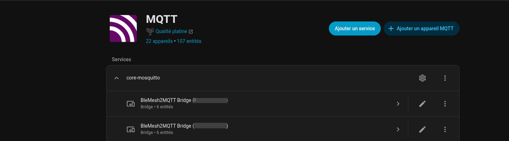
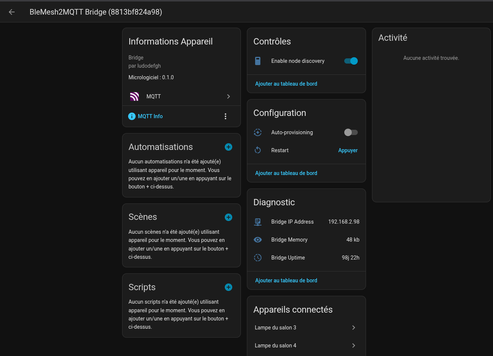

# BLEMesh2MQTT Bridge — User Guide

This guide explains how to use the bridge's web interface and how to find it in Home Assistant.

> **Two editions.** The bridge exists as **Standalone** (it creates its own BLE Mesh network
> and adds your lights) and **Companion** (it joins a network you already manage with a phone
> app such as nRF Mesh). The dashboard header shows which one you have
> (**BleMesh2MQTT Standalone** or **BleMesh2MQTT Companion**). Most of this guide applies to
> both; parts marked *Standalone only* or *Companion only* don't.
> Unsure which one you need? See **[Standalone or Companion?](EDITIONS.md)**

---

## Table of Contents

1. [Bridge Web Interface](#1-bridge-web-interface)
   - [Bridge Page](#11-bridge-page)
   - [Mesh Page](#12-mesh-page)
   - [Firmware Page](#13-firmware-page)
   - [System Logs](#14-system-logs)
2. [Home Assistant Integration](#2-home-assistant-integration)
   - [MQTT Integration View](#21-mqtt-integration-view)
   - [Bridge Device Detail](#22-bridge-device-detail)
   - [Lights and Covers](#23-lights-and-covers)

---

## 1. Bridge Web Interface

Once the bridge is connected to your WiFi network, open its IP address in a browser
(e.g. `http://192.168.2.98`).

The left menu has three pages: **Bridge**, **Mesh** and **Firmware**. The system logs are
in a panel at the bottom of every page. The header shows the edition and version, uptime
and free memory, and a button to switch between dark and light themes.

---

### 1.1 Bridge Page

#### Bridge Controls

| Indicator / Button | Description |
|---|---|
| **Free Memory** | Available memory on the ESP32. Keep an eye on it if the bridge becomes unstable. |
| **Total Memory** | Total memory of the chip. |
| **Auto-provisioning** *(Standalone only)* | When on, the bridge adds every new BLE Mesh device it detects without you clicking **Provision**. Off by default. |
| **Send MQTT Discovery** | Re-announces the bridge and all devices to Home Assistant (useful if HA doesn't show them). |
| **Send MQTT Status** | Publishes the current state of all devices to MQTT. |
| **Restart Bridge** | Reboots the bridge. |

#### WiFi Status
- **SSID**, **IP address**, **subnet mask / gateway**: the network the bridge is connected to.
- **MAC address**: the bridge's unique identifier, also used for its MQTT topics and in HA.
- **RSSI**: WiFi signal strength in dBm (closer to 0 is stronger).
- **TX power**: WiFi transmit power, adjustable with the slider and **Apply**.
- **Reset WiFi**: forgets the WiFi credentials and restarts into the setup access point
  (`BleMesh2MQTT-Setup-…`) to configure it again.

#### MQTT Configuration

| Field / Button | Description |
|---|---|
| **Broker Host** | IP address or hostname of the MQTT broker (e.g. the Mosquitto add-on of Home Assistant). |
| **Port** | Usually `1883`. |
| **Username / Password** | Broker credentials. |
| **Save Configuration** | Saves and reconnects to the broker. |
| **Test Connection** | Tries the settings without saving them. |
| **Clear** | Clears the saved MQTT configuration. |

The status badge in the panel's corner shows whether the bridge is connected to the broker.

#### Version Information
Firmware version, git version, ESP-IDF version and build date of what's running.

---

### 1.2 Mesh Page

#### Group Address Subscriptions *(Companion only)*
The group addresses your lights are subscribed to in your mesh app (up to 3, e.g.
`0xC000`). That's where the bridge looks for lights. Add one with **Add**, remove one with
its ×. Changes apply immediately, no restart needed.

#### Mesh Network
- **Address** *(Companion only)*: the bridge's own address in your network, given by your
  mesh app when it added the bridge.
- **NetKey / AppKey**: the network's keys (click one to copy it). *Standalone:* generated by
  the bridge. *Companion:* received from your mesh app.
- **Leave mesh network** *(Companion only)*: removes the bridge from the network, forgets
  all its lights (and their Home Assistant entities), and makes the bridge available to be
  added again. Removing the bridge from your phone app ("Reset node" in nRF Mesh) is
  cleaner, because the app then knows it's gone.

#### Mesh
The devices, as cards. The counters in the corner show how many are provisioned and how
many are waiting *(Standalone only)*.

**Provisioned nodes** *(Standalone only)*: the lights the bridge added to its network.

**Unprovisioned devices** *(Standalone only)*: BLE Mesh devices in range that aren't in a
network yet, with their UUID and signal strength (RSSI). **Provision** adds one to the
bridge's network; **Refresh** updates the list.

> **Tip:** if a light doesn't show up, make sure it's powered on, factory-reset (pairing
> mode) and within a few metres of the bridge, then click **Refresh**.

**External mesh nodes** *(Companion only)*: the lights the bridge found in its group
addresses. **Discover** searches again (the bridge also does it by itself after starting
and every 10 minutes). **Group ON / Group OFF** switch every light of the first group.

#### Node cards
Every light has a card with two tabs:

- **Controls**: only what the light supports — **Power** switch, 💡 brightness,
  **H**ue and **S**aturation for colour lights, 🌡 colour temperature for tunable-white
  lights, 🎚️ level for devices that only support a level (shutters, blinds…).
- **Advanced**: address, UUID, manufacturer (provisioned nodes) or detected features and
  "last seen" (external nodes), plus:
  - **MQTT Status**: publishes this light's state to Home Assistant.
  - **MQTT Discovery**: announces this light to Home Assistant again.
  - **Unprovision** *(Standalone)*: removes the light from the network; it shows up again
    under unprovisioned devices.
  - **Forget** *(Companion)*: removes the light from the bridge and Home Assistant only.
    It stays in your network, since only your phone app can remove it, and the next
    discovery finds it again.

The badge shows **Online** or **Offline**. On an external node, Offline means it hasn't
answered for about 25 minutes. Provisioned nodes can be renamed by clicking their name.

---

### 1.3 Firmware Page

Updates the bridge over WiFi (OTA). **Running** shows the installed version.

| Update type | File to upload | What it updates |
|---|---|---|
| **Firmware + Web** *(recommended)* | `update_bundle.bin` | Both, with a single restart. |
| **Firmware** | `BleMesh2Mqtt.bin` | The bridge's program only. It restarts when done. |
| **Web interface** | `storage.bin` | The dashboard files only. |

1. Download the release `.zip` for **your edition and chip** from the releases page and
   extract it.
2. Choose the update type, then drop the file on the upload area (or **Choose file**).
3. Click the **Update** button and wait for it to finish.

Good to know:
- The **OTA API key** shown on this page is generated by the bridge and authenticates
  every upload. The dashboard uses it for you; you only need it for scripted uploads.
- A firmware update only accepts **the same edition**: a Standalone bridge refuses a
  Companion firmware and vice versa. Switching editions requires a USB flash
  (see [EDITIONS.md](EDITIONS.md)).
- On **ESP32-C3, C5 and C6**, firmware updates over WiFi don't work yet
  ([#44](https://github.com/ludodefgh/esp32-blemesh2mqtt/issues/44)): update those over USB.
  The **Web interface** update works.

> **Warning:** don't unplug the bridge during an update.

---

### 1.4 System Logs

The **System Logs** bar at the bottom of every page opens a live log console (drag its top
edge to resize it). **Auto-scroll** follows new lines; **Clear** empties the view. It only
shows what happens while the page is open.

---

## 2. Home Assistant Integration

The bridge and its lights appear in Home Assistant by themselves, via **MQTT Discovery**,
as long as Home Assistant's MQTT integration uses the same broker.

---

### 2.1 MQTT Integration View

In Home Assistant, go to **Settings → Devices & Services → MQTT**.

Each bridge appears as a **BleMesh2MQTT Bridge (MAC address)** device. Its model shows the
edition: **Bridge (Standalone edition)** or **Bridge (Companion edition)**.

> If the bridge doesn't appear, click **Send MQTT Discovery** on the dashboard's Bridge page.

---

### 2.2 Bridge Device Detail

#### Controls and configuration
- **Enable node discovery** *(Standalone only)*: turns the detection of new BLE Mesh devices
  on or off.
- **Auto-provisioning** *(Standalone only)*: same as the dashboard switch.
- **Restart**: reboots the bridge.

#### Diagnostic

| Entity | Description |
|---|---|
| **Bridge IP Address** | The bridge's IP address. |
| **Bridge Memory** | Free memory on the ESP32. |
| **Bridge Uptime** | Time since the bridge last started. |
| **Bridge WiFi RSSI** | WiFi signal strength. |

#### Connected devices
The lights handled by the bridge, each as its own device: named as you set them
*(Standalone)*, or **External Node XXXX** after their mesh address *(Companion)*.

---

### 2.3 Lights and Covers

- A light shows the controls it supports: on/off, brightness, colour (hue/saturation)
  and/or colour temperature.
- A device that only supports a level (Generic Level, e.g. a shutter motor) appears as a
  **cover** (blind) with open, close and a position from 0 to 100 %.
